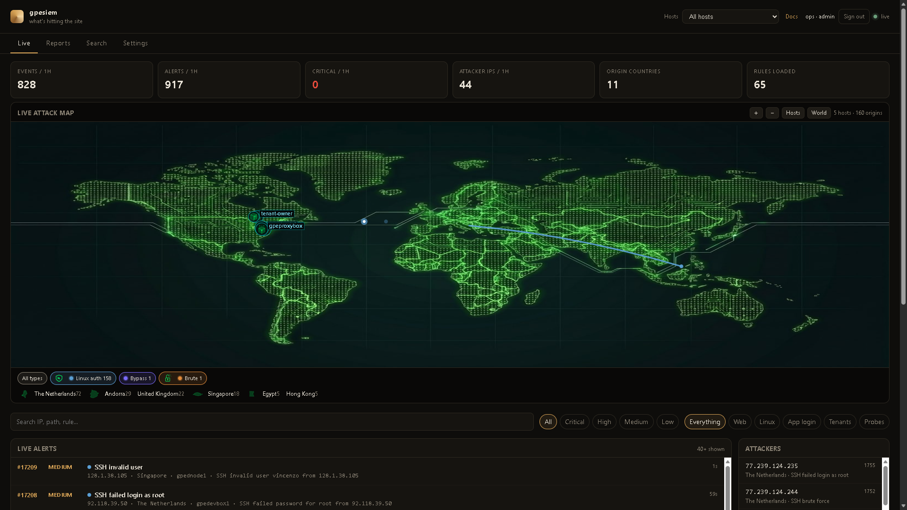
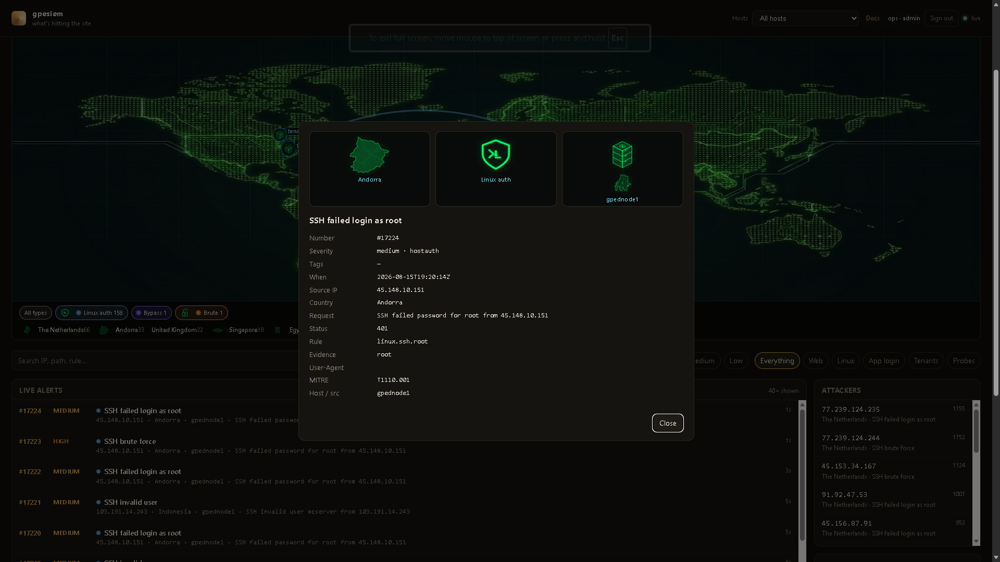
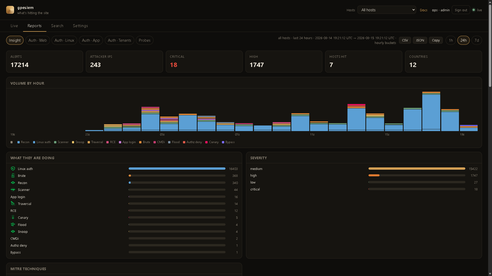
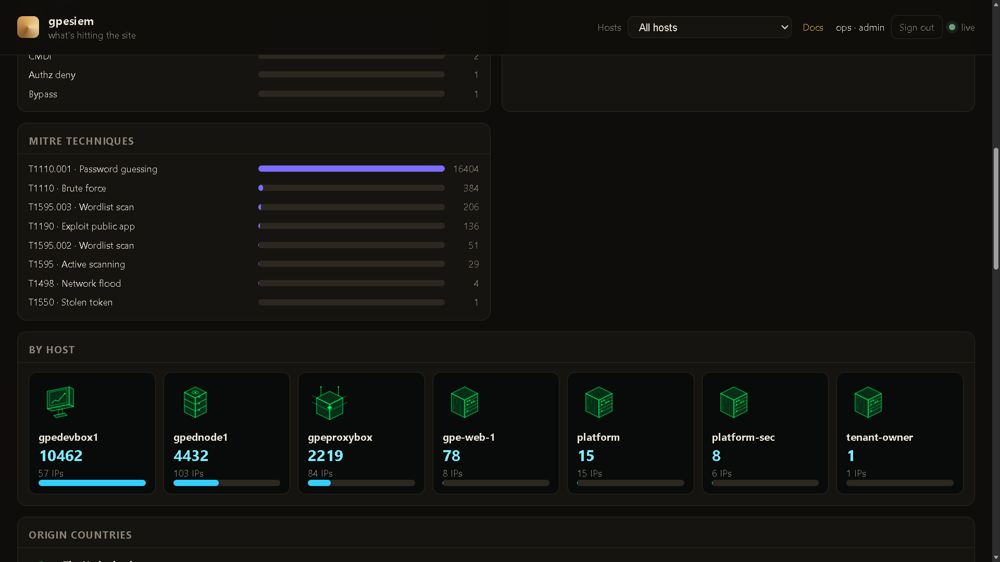
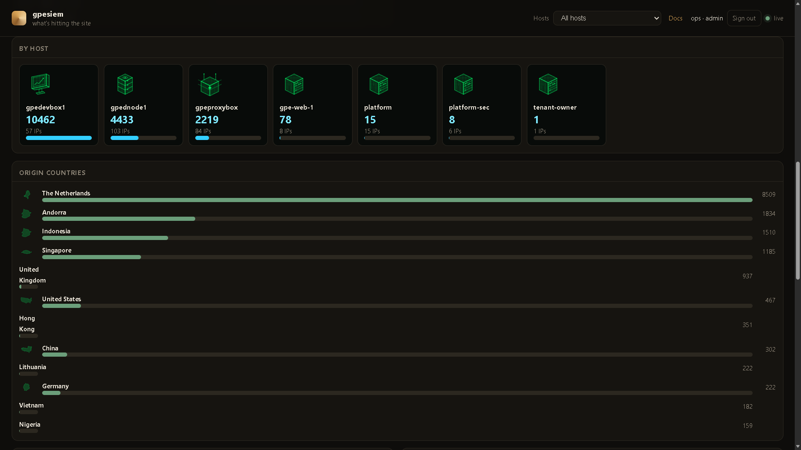
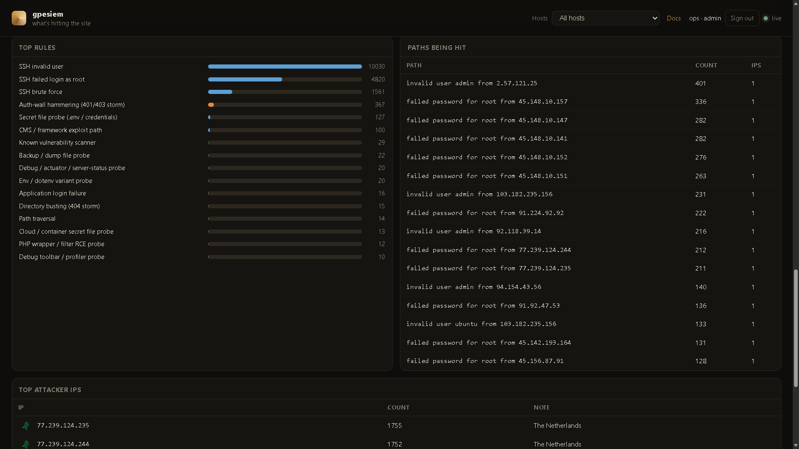
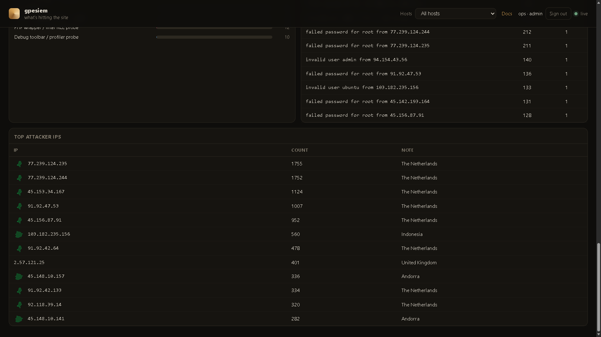
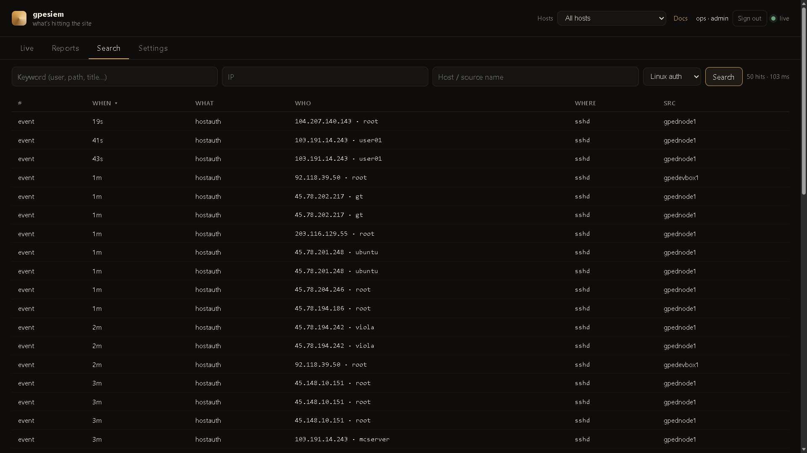
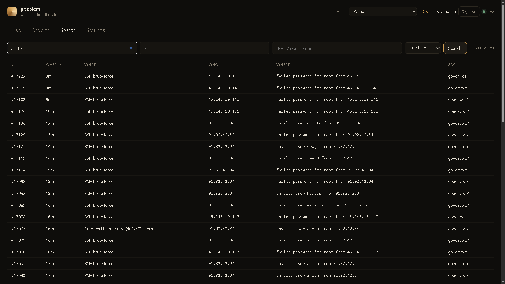

# GPEWebDefender

A **web-attack monitor**. It sits next to nginx / Caddy / the app, tails access logs, and tells you when a site is being probed or exploited. If this process dies, the site keeps serving.

It is not Wazuh, not OSSEC, and not a WAF.

The command is `gpewebdefender`. Hosts, tokens, map pins, GeoIP, and log paths are flags or env files — nothing about a specific company or server is compiled in.

**If you have never run this:** read this file top to bottom once, then do Method A or Method B. Do not skip “Pick a shape.”

Full picture: [`dochub/index.html`](dochub/index.html) or `/docs/` on a running manager. Start at **03 · Install & run**.

---

## What it looks like

Live dashboard from a real operator box. Your names and pins will be whatever you configure.

### Live map

A shot fires only when an alert happens — attacker country to the host that was hit — then it goes away. Hosts stay on the plate. The feed is the same events, numbered.



### Alert card

Click a row. Country plate, attack-type mark, and the server that was hit, plus the usual fields (rule, MITRE, evidence). No standing tracks.



### Insight

Reports → **Insight**. Same alerts, broken down. 1h / 24h / 7d is a real clock. Click a bar or host card to Search. **CSV** / **JSON** / **Copy** export that window (session cookie, no ingest token in the file).











### Search

FTS5 on the manager. Keyword, IP, host, kind. Newest first (click **When** to flip). No Elasticsearch.





### Status

**Status** is on demand. Click **Check now** (or **Check all paired hosts**) when you want load, memory, and disk. The manager answers immediately. A paired sensor answers on its next command poll (a few seconds). Charts are the snapshots *you* asked for — nothing is scraped in the background. Pairing is the same flow as block (DocHub **20** / **21**).

---

## Pick a shape

| You have | Install |
|----------|---------|
| A laptop and curiosity | `gpewebdefender demo` — fake attacks, not your site |
| One Linux box that already writes an access log | **All-in-one** — manager tails that log. No agent. |
| A small extra box + one or more web servers | **Split** — manager on the extra box, one agent per web (or SSH) host |

Do **not** open port 8787 to the internet. Default listen is `127.0.0.1:8787`. Use an SSH tunnel until you put HTTPS + a login in front.

---

## Look first (any OS)

```bat
go build -o gpewebdefender.exe .\cmd\gpewebdefender
gpewebdefender.exe demo
```

Linux:

```sh
go build -o gpewebdefender ./cmd/gpewebdefender
./gpewebdefender demo
```

Open http://127.0.0.1:8787  
Those map shots are **invented**. See DocHub **04** before you treat a dashboard as reality.

---

## Method A — the script (Linux + systemd)

From this repo, as root. Build a Linux binary first if you are on Windows:

```powershell
$env:GOOS="linux"; $env:GOARCH="amd64"; $env:CGO_ENABLED="0"
go build -o gpewebdefender-linux-amd64 .\cmd\gpewebdefender
```

**All-in-one** (this box has the access log):

```sh
chmod +x deploy/install-manager.sh deploy/install-agent.sh
sudo ./deploy/install-manager.sh --all-in-one \
  --tail /var/log/nginx/access.log \
  --journal \
  --home 40.7,-74.0
```

**Split** (monitor first, then each web box):

```sh
# on the monitor
sudo ./deploy/install-manager.sh --home 40.7,-74.0

# on a web / SSH box
scp root@MONITOR:/usr/local/bin/gpewebdefender /usr/local/bin/gpewebdefender
scp root@MONITOR:/etc/gpewebdefender/env /etc/gpewebdefender/env
sudo ./deploy/install-agent.sh \
  --url http://MONITOR:8787 \
  --name web-1 \
  --tail /var/log/nginx/access.log \
  --journal
```

Replace `MONITOR`, `web-1`, and the log path with *your* values.

Optional later — that host can take block orders: Settings → Paired hosts → phrase + code, then add `--code ABCD-2341 --block fail2ban` to `install-agent.sh`. DocHub **20**.

Then from your laptop:

```sh
ssh -L 8787:127.0.0.1:8787 user@THEBOX
```

Open http://127.0.0.1:8787/login and create the first **admin** (a person). That is not the ingest token.

---

## Method B — you type every file

1. Copy the binary to `/usr/local/bin/gpewebdefender` and `chmod +x`.
2. `useradd --system --home /var/lib/gpewebdefender --shell /usr/sbin/nologin gpewebdefender`
3. Copy `rules/` and `dochub/` into `/var/lib/gpewebdefender/`.
4. Copy `deploy/env.example` to `/etc/gpewebdefender/env`. Put a long random `GWD_TOKEN`. Mode `640`.
5. Copy `deploy/gpewebdefender.service.example` to systemd. Edit home / tail if needed.
6. `systemctl daemon-reload && systemctl enable --now gpewebdefender`
7. Other hosts: `deploy/gpewebdefender-agent.service.example` with the **same** token, a stable `--name`, and `--tail` / `--journal`.

Examples live in [`deploy/`](deploy/).

---

## After it is up (do these in order)

1. Tunnel + `/login` → first admin. Or set `SIEM_ADMIN_USER` + `SIEM_ADMIN_PASSWORD` once, then **delete the password line**.
2. **Settings** → name the dashboard, pin the site (`US` or `40.7,-74.0`), one row per agent `--name`.
3. **Live** — shots fire only when an alert happens, then they go away.
4. **Reports → Insight** — 1h / 24h / 7d is a real clock. Click a bar to Search. **CSV** / **JSON** export is that same window (session cookie, no token in the file).
5. Optional GeoIP: drop a MaxMind / DB-IP `.mmdb` and pass `--geoip`.
6. Optional HTTPS: `deploy/nginx-gwd.conf.example`. Deny `/api/ingest` on the public vhost. DocHub **15** and **18**.
7. Optional app denials the access log cannot see: POST JSON to `/api/ingest`. Never send passwords. DocHub **19**.
8. Optional **block from the dashboard**: Settings → Paired hosts → invent a phrase → mint a code → on the sensor `gpewebdefender pair --url … --name web-1 --code … --block fail2ban` → Approve. DocHub **20**. Viewer and the ingest token cannot ban. Not automatic.
9. Optional **Status**: open Status and click **Check** on the manager (works immediately). Pair a host (same as step 8) to Check that box for load / memory / disk. Nothing is polled until you click. Agents need 0.9.25+. DocHub **21**.
10. **Protect the site** (DocHub **22**): plant `/.well-known/siem-canary`, confirm `GET /@vite/client` is not 200 on the public host, POST `kind=secprobe` for IDOR / webhooks / score abuse the access log cannot see. Never send passwords.

If the UI is empty: you are not in demo, and no `--tail` / agent has sent a line yet. `journalctl -u gpewebdefender -n 50`.

---

## What it watches

Anything that shows up in an access log:

- SQL injection, XSS, path traversal, command injection, SSTI, PHP wrappers
- Log4Shell / Spring4Shell / cloud-metadata SSRF in the URL or UA
- Secret-file and admin hunting (`.env`, `.git`, phpMyAdmin, wp-login, actuators)
- Known scanners (sqlmap, nuclei, nikto, ffuf, …)
- 404 storms, 401/403 hammering, login brute force, request floods
- Optional: sshd / sudo via `--journal` or `auth.log`
- Front-end leak: `/@vite`, `/@fs`, `/src/main.jsx`, served `.js.map` (a 200 is a leak)
- Optional: your app POSTs `kind=applogin` / `tenantlogin` / `secprobe` (IDOR, canary, webhook, score abuse, …). DocHub **19** / **22**.

It **cannot** see POST bodies unless you log them (you usually should not).

## Log formats

nginx / Apache combined, or nginx / Caddy / Traefik JSON. JSON is worth switching to. See DocHub **05**.

## Rules

Built-in YAML in `rules/`. Extra files: `--rules path/to/more.yaml`. Optional CMS honey: `--rules packs` (loads `packs/cms.yaml`). Not a plugin scanner.

## Resource target

One static Go binary + SQLite. A dedicated **2 CPU / 2 GB** box is plenty. No JVM, no OpenSearch, no Elasticsearch.

## Publish / build

This tree is the public product. It has no inventory, tokens, or hostnames.

```bat
go test ./...
set GOOS=linux
set GOARCH=amd64
set CGO_ENABLED=0
go build -o gpewebdefender-linux-amd64 .\cmd\gpewebdefender
```

Keep live fleet config out of this repository.
